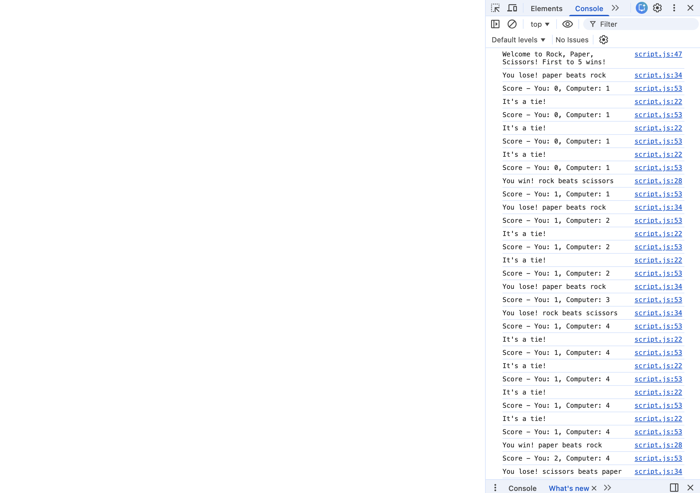

# rock-paper-scissors

<strong>The final product: </strong>

what is it:
- a game of rock paper scissors, played entirely on the console

How does it work:
- user inputs an option of rock, paper, or scissors and sees if they win against the computer's randomized choice.
- This goes until one of them reaches a score of 5, at which point the game ends

skills practiced:
- practicing javascript basics
  - i.e. function calling, regex, loops
- atomic commits
- having an actually usable readme ;)
